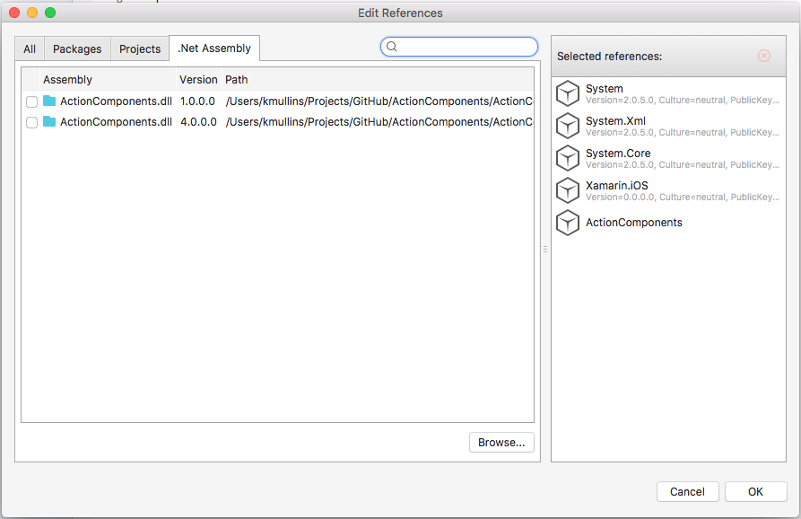

# About Action Table

**Action Table** is a custom Table View Controller for iOS and custom **ListView** for Android that supports a range of features that allow you to create complex Table/List Views quickly, all with a minimum of code. Focus on your user interface design and not the details of implementation, **Action Table** does all the heavy lifting for you.

# Running the Samples

Before you can successfully build and run these sample apps, you'll need to download and install the [Action Components Trail](http://appracatappra.com/products/action-components/) version from the Appracatappra website or have purchased and installed a licensed version of the components.

Next, open either the iOS or the Android version of the sample in Visual Studio and expand the **Resources** folder:


If the `ActionComponents` entry is grayed-out with a red X (as shown in the image above), right-click on it and select **Delete**. Double-Click the **Resources** folder to open the **Edit References** dialog and select the **.Net Assembly** tab:



Click the **Browse** button, navigate to where you installed the **Action Components** trial or licensed version and locate the appropriate `ActionComponents.ddl` (for either iOS or Android) and click the **OK** button. The sample will now be ready to run.

# Easy Implementation

Tired of having to create a custom **TableViewController**, **TableViewDataSource**, and **TableViewDelegate** class for each table type that you wanted to implement in you mobile app? So are we, that’s why we created Action Table. By implementing the `RequestData` event on the **Action Table‘s** `dataSource` property you can quickly populate any **Action Table** without having to create custom classes.

Use `ACTableSections` to hold collections of `ACTableItems` to quickly define the structure and format of your table data. Pass this information to an Action Table‘s dataSource and display complex tables with a minimum of code, all in OS specific UI.

# Accessory Items

The **Action Table** `ACTableItem` class defines several helper function that make attaching accessory views a snap so you can quickly add things like switches and buttons to your table items without have to code them by hand. **Action Tables** make easy work of implementing your mobile apps settings.

The following helper function are available:

* `AddAccessorySwitch`
* `AddAccessoryStepper`
* `AddAccessorySlider`
* `AddAccessoryActionImageView`
* `AddAccessoryButton`
* `AddAccessoryTextField`

# Events

Action Tables support a number of events to respond to user interaction at the `ACTableViewController`, `ACTableSection` and `ACTableItem` levels. Several events such as `ItemsSelected` or `AccessoryButtonTapped` cascade so they can be handle at any point along the chain from controller to source data item.

# Cross Platform

**Action Table** was designed to be highly code compatible across platforms so the same code you use to populate it in iOS can be used in the Android version of your mobile app with little or no modification. Several iOS specific table features such as **DisclosureButtons** and **DisclosureIndicators** have been ported to the Android version as well (all rendered in an Android Specific way) to assist in cross platform design.

Adding Accessories is supported on Android using the same function names as the iOS version, however all of the accessories will be converted to their Android specific counterparts as follows:

* `AddAccessorySwitch` – Will be rendered as a `ToggleButton`.
* `AddAccessoryStepper` – Will be rendered as a `SeekBar`.
* `AddAccessorySlider` – Will be rendered as a `SeekBar`.
* `AddAccessoryTextField` – Will be rendered as an `EditText`.

# Features

**Action Table** includes a fully documented API with comments for every feature. **Action Table** is available exclusively as part of the Action Component Suite by Appracatappra, LLC.

# iOS Example

**Action Table** was designed to make adding it to a project super easy. Here is a example of creating a simple **Action Table** in code:

```csharp
using ActionComponents;
...

private ACTableViewController _componentTable;
...

// Add the component table to the tray
_componentTable = new ACTableViewController (UITableViewStyle.Plain, new RectangleF (5, 3, componentTray.Frame.Width-10, componentTray.Frame.Height-40));
componentTray.AddSubview (_componentTable.TableView);
_componentTable.cellSelectionStyle = UITableViewCellSelectionStyle.None;

// Wire-up data request event
_componentTable.dataSource.RequestData += (dataSource) => {
    // Populate table with data
    var section = dataSource.AddSection("Action Components");

    // Add items to table
    section.AddItem("Action Table","For iOS and Android",true);
    section.AddItem("ActionTray","For iOS and Android",true);
    section.AddItem("ActionView","For iOS",true);
    section.AddItem("ActionViewSplitter","For iOS",true);
    section.AddItem("DownloadManager","For iOS and Android",true);
    section.AddItem("NavBar","For iOS and Android",true);
};

// Wire-up item selection
_componentTable.ItemsSelected += (item) => {
    // Change the title of the tray
    componentTray.title = item.text;

    // Save selected component and display about document
    controller.currentComponent = item.text;
    webView.LoadFile (String.Format("Documents/{0}About.pdf",controller.currentComponent));

    // Close the tray
    componentTray.CloseTray(true);
};

// Ask the controller to populate the table
_componentTable.LoadData ();
```

**NOTE:** **Action Tables** can be completely created in C# code or by using `.storyboard` or `.xib` files.

# Android Example

Here is an example of populating an Action Table that was defined in a `.axml` file:

```csharp
using ActionComponents;
...

private ACTableViewController documentList;
...

// Access interface items
documentList = FindViewById<ACTableViewController>(Resource.Id.documentList);

// Configure table
documentList.activity = this;
documentList.allowsSelection = true;

// Wire-up data request event
documentList.dataSource.RequestData += (dataSource) => {
    // Populate table with data
    var section = dataSource.AddSection("Action Components",Resource.Drawable.book,"The ActionPack Component Suite");

    // Add items to table
    section.AddItem("Action Table","For iOS and Android",true);
    section.AddItem("ActionTray","For iOS and Android",true);
    section.AddItem("ActionView","For iOS",true);
    section.AddItem("ActionViewSplitter","For iOS",true);
    section.AddItem("DownloadManager","For iOS and Android",true);
    section.AddItem("NavBar","For iOS and Android",true);
};

// Ask the controller to populate the table
documentList.LoadData ();

//Auto select the current component
documentList.SelectItem (currentComponent);

//Wire-up touch handler
documentList.ItemsSelected += (item) => {
    //Save new component
    currentComponent = item.text;
};
```

# Trial Version

The Trial version of Action Table is fully functional however the background is watermarked. The fully licensed version removes this watermark.